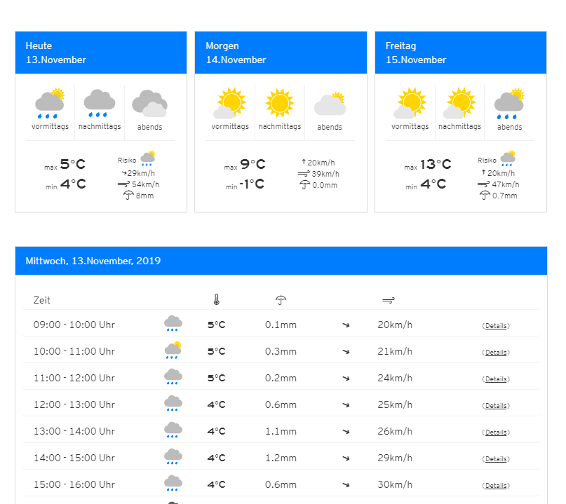

# Routen des Webservices
Starte mit *dotnet run* den Webserver aus dem richtigem Ordner heraus:
```
Pos5xhif\02_Views\02_AJAX\Webserver>dotnet run
```

- HTML View (index.html in wwwroot): http://localhost:5001
- Vorhersage stündlich: http://localhost:5001/forecast?lat=48&lng=16&height=200
- Daily Summaries: http://localhost:5001/forecast/dailySummary?lat=48&lng=16&height=200

## Übung
Zeige wie auf https://kachelmannwetter.com/at/vorhersage/2761369-wien/xl die Daten des eingegebenen
Standorts als Grafik an. Zeige zuerst eine Übersicht über die nächsten 3 Tage an. Hierfür kannst du
die Route *dailySummary* verwednen.

Darunter zeige dei Stundenwerte als Tabelle an.


