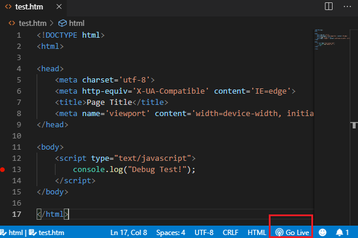

# HTML Views

## Visual Studio Code Extensions
Um bequem arbeiten zu können, werden 2 Extensions und der Chrome Browser benötigt:
- Live Server von Ritwick Dey
- Debugger for Chrome von Microsoft

### Installation und Konfiguration der Live Server Extension
Installiere die Extension Live Server in Visual Studio. Öffne danach mit *F1* das Menü und gib das Wort
*settings.json* ein. Aus der Auswahl wähle den Eintrag *Preferences: Open Settings (JSON)*.

Füge nun in der Datei *settings.json* die folgende Zeile innerhalb der geschweiften Klammern ein:
```js
    "liveServer.settings.port": 8080
```

### Erstellen einer leeren HTML Seite in einem Ordner
Erstelle einen Ordner auf deiner Festplatte. Öffne danach mit *File - Open Folder* diesen Ordner und lege
eine Datei *test.htm* an. Füge nun folgenden Code ein:
```html
<!DOCTYPE html>
<html>

<head>
    <meta charset='utf-8'>
    <meta http-equiv='X-UA-Compatible' content='IE=edge'>
    <title>Page Title</title>
    <meta name='viewport' content='width=device-width, initial-scale=1'>
</head>

<body>
    <script>
        console.log("Debug test.");
    </script>
</body>

</html>
```

Hinweis: Mit *STRG* + *Leertaste* kann ein leeres HTML Gerüst als Snippet eingefügt werden.

### Ausführen des Servers
In der unteren Leiste befindet sich durch die Installation von Live Server ein Button mit der Aufschrift
*Go Live*. Durch Klicken startet der Standardbrowser. Kontrolliere, ob der Port auch 8080 wie oben eingestellt
ist.



### Aktivieren des Debuggers: launch.json
Wird in VS Code die Taste *F5* gedrückt, wo wird nach der Datei *.vscode/launch.json* gesucht. Um diese Datei
zu erstellen, wähle in der Debugpalette den Punkt *Configure or Fix lauch.json*:


Wenn nun in der Zeile mit der Konsolenausgabe ein Haltepunkt gesetzt wird, startet mit *F5* der Browser
und über Remote Debugging bleibt der Editor bei diesem Punkt stehen.

