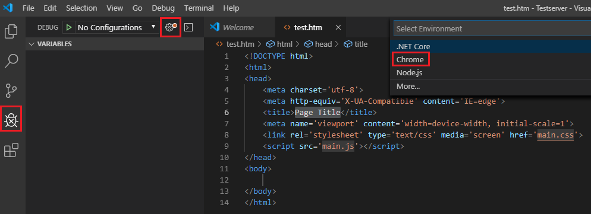

# HTML Views mit Vue.js

## Visual Studio Code Extensions
Um bequem arbeiten zu können, werden 2 Dinge benötigt:
- Ein Webserver (ASP.NET Core 3.0).
- Die VS Code Extension *Debugger for Chrome von Microsoft* benötigt.

### Ausführen des Webservers
Da wir in den Beispielen auch Daten von einem Webservice laden wollen, wird dieses immer in den Übungen
in Form einer ASP.NET Core Applikation mitgeliefert. Diese App muss kompiliert und gestartet werden.
Lade dafür von der [.NET Downloadseite](https://dotnet.microsoft.com/download) die neueste Version von .NET Core.
Verwende den Punkt *Download .NET Core SDK*, um die Apps kompilieren zu können.

Um die Installation zu testen, synchronisiere dein Repository und gehe in der Konsole in das Verzeichnis
der ersten Übung (*01_SimpleBinding*). Gib in diesem Verzeichnis folgenden Befehl ein:
```
dotnet run
```

.NET Core kompiliert nun das ASP.NET Core Programm in diesem Ordner und der Server ist unter *http://localhost:8080*
erreichbar. Die HTML Dateien, die wir in den Übungen bearbeiten, sind im Unterordner *wwwroot*. Hinweis:
der Port kann in der Datei *launchSettings.json* im Ordner *Properties* geändert werden. Natürlich muss
dann die Datei *launch.json* für den VS Code Debugger ebenfalls angepasst werden.

### Aktivieren des Debuggers: *launch.json*
Öffne in VS Code mit *File* - *Open Folder* den Ordner *01_SimpleBinding*. Um das Remote Debugging zu
konfigurieren muss die Datei *launch.json* erstellt werden. Wähle dafür in der Debugpalette den Punkt 
*Configure or Fix lauch.json*:



Damit das Remote Debugging mit ASP.NET Core funktioniert, muss der Eintrag *webRoot* auf den Wert
*${workspaceFolder}/wwwroot* gesetzt und in der URL die Datei *index.html* ergänzt werden:

```js
{
    // Use IntelliSense to learn about possible attributes.
    // Hover to view descriptions of existing attributes.
    // For more information, visit: https://go.microsoft.com/fwlink/?linkid=830387
    "version": "0.2.0",
    "configurations": [
        {
            "type": "chrome",
            "request": "launch",
            "name": "Launch Chrome against localhost",
            "url": "http://localhost:8080/index.html",
            "webRoot": "${workspaceFolder}/wwwroot"
        }
    ]
}
```

### Testen des Debuggers
Setze in der Datei *index.htm* in der Zeile mit *console.log("Test für den Debugger!");* einen Haltepunkt.
Starte mit *F5* den Browser und prüfe, ob der Debugger an dieser Stelle hält.
