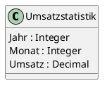

# Probeklausur für POS: Fahrzeugvermietung

## Umgebung

Im Labor steht Visual Studio 2017 mit der .NET Core Version 2.1.520 zur Verfügung. Die C# Sprachversion
ist 7.3. Daher können keine nullable reference Types oder records verwendet werden. Alle erstellten
C# Projektdateien (csproj) müssen sich daher auf .NET Core 2.1 beziehen:

```xml
  <PropertyGroup>
    <TargetFramework>netcoreapp2.1</TargetFramework>
  </PropertyGroup>
```

## Musterprojekt

In der Datei [Spg_Fahrzeugvermietung.sln](Spg_Fahrzeugvermietung/Spg_Fahrzeugvermietung.sln) ist
eine Solution auf Basis von .NET Core 2.1 gespeichert, die die grundlegende Aufteilung der Arbeit
schon beinhaltet:

- Projekt Spg_Fahrzeugvermietung.Application: Domainklassen, Services und Infrastruktur (DbContext)
- Projekt Spg_Fahrzeugvermietung.Test: Projekt für die xUnit Tests
- Projekt Spg_Fahrzeugvermietung.Rest: Projekt für die ASP.NET Core 2.1 REST API

## Über die Aufgabenstellung

Im Rahmen dieser Probeklausur soll das Backend einer kleinen Fahrzeugvermietung implementiert werden.
Es werden Fahrzeuge verschiedener Kategorien (PKW, Transporter, Motorrad und neuerdings auch eBikes)
an Kunden vermietet. Da die eBikes bis zu 45 km/h schnell fahren, werden sie in auch als Fahrzeuge behandelt.

Die erforderliche *Lenkberechtigung* wird nur gespeichert, wenn sie von einem Autoführerschein
(Kategorie B) abweicht. Das ist bei stärkeren Motorrädern oder Transportern über 3.5t der Fall.
eBikes fallen bis 250W unter die Kategorie "ohne", darüber ist ein Mopedausweis erforderlich.

Die Miete richtet sich nach gefahrenen Kilometern sowie einen pro Fahrzeugtyp
definierten (täglichen) Grundpreis. Der Preis pro Kilometer ist natürlich abhängig vom konkreten Fahrzeug, für
das Benutzen eines Tesla ist mehr zu bezahlen als für einen klassischen Kleinwagen.

Das Domainmodel wurde aufgrund von Vorbesprechungen schon entwickelt und hat folgendes Aussehen:

```plantuml
enum Lenkberechtigung {
    Ohne
    Moped
    Motorrad
    Lkw
}

class Fahrzeug {
    Kennzeichen : String
    Kilometerstand : Integer
    Lenkberechtigung : Lenkberechtigung
    Tagesmiete : Decimal
    PreisProKm : Decimal
}

class EBike {
    MotorleistungWatt : Integer
}

class Motorrad {
    HubraumCcm : Integer
}

class Pkw {
    AnzahlSitzplaetze : Integer
}

class Transporter {
    MaxNutzlast : Integer
    Gesamtgewicht : Integer
}

class Kunde {
    Name : Name
    FuehrerscheinNr : String
    Email : String
}

class Vermietung {
    Kunde : Kunde
    Fahrzeug : Fahrzeug
    VerliehenAb : DateTime
    VerliehenBis : DateTime
    Rechnungsbetrag : Decimal
}

class Name <<embeddable>> {
    Vorname : String
    Nachname: String
}

Fahrzeug -- Lenkberechtigung
EBike --|> Fahrzeug
Motorrad --|> Fahrzeug
Pkw --|> Fahrzeug
Transporter --|> Fahrzeug

Fahrzeug -- Vermietung
Kunde -- Vermietung
Name -- Kunde
```

## Teilthema Domain Model, O/R Mapping und Persistence

Ihre Aufgabe ist es, das entworfene UML Klassendiagramm in C# Klassen umzusetzen. Sie können
dafür einfache POCO Klassen mit offenen set Properties verwenden. Records aus C# 9 oder Klassen
mit Konstruktoren können durch die vorgegebene EF Core 2 bzw. C# 7.3 Umgebung nicht verwendet werden.

Die erstellten Klassen sollen in eine physische SQLite Datenbank persistiert werden. Anforderungen
hinsichtlich der Primärschlüssel (neue Id Felder oder bestehende Felder), der konkreten Datentypen
(nullable, Länge, ...) sind keine vorgeschrieben. Es muss jedoch der in der Datei [data.sql](data.sql)
vorhandene SQL Dump eingespielt werden können.

Dafür wird im Musterprojekt die Methode *Import()* als Extensionmethode von *DbContext* zur
Verfügung gestellt. Damit kann die Datenbank einfach mit folgenden Anweisungen erstellt werden:

```c#
using (var db = new FahrzeugContext())
{
    db.Database.EnsureDeleted();
    db.Database.EnsureCreated();
    db.Import("data.sql");
}
```

Der SQL Dump geht von folgendem Schema der Datenbank aus, welches aus Ihren Modelklassen heraus
mit *EnsureCreated()* erzeugt werden soll:


Nachdem die Datei [data.sql](data.sql) importiert wurde, implementieren Sie ein *CarRepository*,
welches folgende Abfragen erlaubt:

- Abfrage *eines Fahrzeuges* auf Basis des Kennzeichens. Rückgabetyp: `Fahrzeug`
- Abfrage *von Fahrzeugen*, die mit einer bestimmten Lenkberechtigung gefahren werden dürfen. Rückgabetyp: `IQueryable<Fahrzeug>`
- Abfrage *von Fahrzeugen*, dessen Kennzeichen mit einem bestimmten Bundesland beginnt (W... für Wien). Rückgabetyp: `IQueryable<Fahrzeug>`

Sie können die Funktionen auch im DbContext implementieren, welche das Ergebnis als
`IQueryable<T>` zurückgeben.

Schreiben Sie Tests in xUnit, welches diese Funktionen aufgrund der Testdaten überprüft. Sie können
die Testdaten mit DBeaver einsehen oder am Ende der Angabe nachsehen.

## Teilthema Service Layer / Business Logic

Schreiben Sie eine Klasse *RentalService*, die zwei für den Businessbetrieb erforderlichen Methoden
beinhaltet:

**TryRentVehicle(int customerId, int vehicleId, DateTime dateFrom, DateTime dateTo)** Versucht,
ein bestimmtes Auto für einen bestimmten Kunden zu reservieren, also einen Eintrag in der Tabelle
*Vermietungen* zu erstellen. Liefert true, wenn der Eintrag angelegt werden konnte. Liefert false,
wenn das Auto in diesem Zeitraum schon reserviert wurde.

Die Testcases sind basierend den vorhandenen Musterdaten geeignet anzulegen.

**CalcMonthlyRevenue()** liefert eine Liste von DTO Klassen mit folgenden Informationen zurück:



Die Testcases sind basierend den vorhandenen Musterdaten geeignet anzulegen.

## Teilthema Presentationlayer / REST API

Implementieren Sie einen *RentalController*, der folgende Methoden
unterstützt:

**GET /api/rental/cars/{Kennzeichen}**

Liefert ein JSON Dokument mit allen Reservierungen des angegebenen Autos
oder HTTP Status 404, wenn es nicht gefunden wurde.

### Response

```javascript
{
    Kennzeichen: 'W96553HU',
    Typ: 'Pkw',
    VerliehenAb: '2020-05-19 14:49:17',
    VerliehenBis: '2020-05-25 14:49:17'
}
```

**GET /api/rental/cars/{Kennzeichen}?year={Jahr}**

Liefert ein JSON Dokument mit allen Reservierungen des angegebenen Autos
aus dem übergebenen Jahr oder HTTP Status 404, wenn es nicht gefunden wurde.

### Response

```javascript
{
    Kennzeichen: 'W96553HU',
    Typ: 'Pkw',
    VerliehenAb: '2020-05-19 14:49:17',
    VerliehenBis: '2020-05-25 14:49:17'
}
```

**POST /api/rental/cars/{Kennzeichen}**

Trägt eine Reservierung in die Datenbank ein. Dafür kann die im vorigen
Punkt geschreiebene Servicemethode verwendet werden. Falls diese nicht
funktioniert, kann auch direkt ohne Überprüfung in die Datenbank geschrieben
werden. Liefert HTTP Status 404, wenn das Autokennzeichen gefunden wurde.

### Request Body (*application/json*)

```javascript
{
    KundeId: 1,
    VerliehenAb: '2021-05-19 13:00:00',
    VerliehenBis: '2021-05-25 13:00:00'    
}
```

**PUT /api/rental/cars/{Kennzeichen}**

Trägt das aktuelle Datum in die Spalte *VerliehenBis* sowie den
übermittelten Rechnungsbetrag ein, wenn der Kunde das Fahrzeug
tatsächlich zurückbringt. Liefert HTTP Status 404, wenn das
Autokennzeichen gefunden wurde.

### Request Body (*application/json*)

```javascript
{
    KundeId: 1,
    VerliehenAb: '2021-05-19 13:00:00',
    Rechnungsbetrag: 214.10
}
```

## Anhang 1: Testdaten aus data.sql

### Tabelle Fahrzeuge

|Id|Kennzeichen|Kilometerstand|Lenkberechtigung|Tagesmiete|PreisProKm|Discriminator|MotorleistungWatt|HubraumCcm|AnzahlSitzplaetze|MaxNutzlast|Gesamtgewicht|
|--|-----------|--------------|----------------|----------|----------|-------------|-----------------|----------|-----------------|-----------|-------------|
|1|W60932NZ|82541||82.0|1.52|Pkw|||2|||
|2||3740|0|9.0|1.0|EBike|243|||||
|3|W79918LK|1449|1|14.0|2.0|EBike|355|||||
|4|W74327DS|1752|1|12.0|2.0|EBike|296|||||
|5|B18206EP|851|1|14.0|1.0|EBike|351|||||
|6|B97915AD|1451|1|9.0|2.0|EBike|365|||||
|7|B18895YB|2582|2|30.0|1.0|Motorrad||903||||
|8|N57777KG|66671|2|25.0|2.0|Motorrad||236||||
|9|B48326HS|41972||26.0|1.0|Motorrad||125||||
|10|W47684DH|81545||20.0|1.0|Motorrad||125||||
|11|W67329JQ|97492||26.0|1.0|Motorrad||125||||
|12|N92748RI|38431|3|48.0|2.0|Transporter||||3885|5006|
|13|B59850KP|12085|3|40.0|2.0|Transporter||||3440|4457|
|14|B26418DK|57841|3|47.0|1.0|Transporter||||2545|3663|
|15|W14067FR|54868|3|39.0|2.0|Transporter||||2457|3640|
|16|N99318RE|20155||77.0|1.3|Pkw|||5|||
|17|W96553HU|68196||80.0|1.08|Pkw|||5|||
|18|N58113XV|25945||93.0|1.23|Pkw|||5|||
|19|W25181FN|62400||76.0|1.52|Pkw|||5|||
|20|B18357KS|97584|3|37.0|2.0|Transporter||||3076|3965|

### Tabelle Kunden

|Id|Name_Vorname|Name_Nachname|FuehrerscheinNr|Email|
|--|------------|-------------|---------------|-----|
|1|Hamza|Balzer|U987457M|balzer@daniel.net|
|2|Tiago|Tillack|X480330R|tillack@linn.de|
|3|Laila|Cleem|Y754966H|cleem@alisa.info|
|4|Boris|Weyel|T607352U|weyel@michaela.org|
|5|Monique|Rohländer|L562985J|rohländer@marlene.org|
|6|Inga|Biedermann|G399671J|biedermann@pierre.de|
|7|Mette|Hoppe|D508303J|hoppe@lee.info|
|8|Sophie|Stelkens|T971406Q|stelkens@lavinia.net|
|9|Oscar|Trautmann|E772632H|trautmann@ada.info|
|10|Leana|Naubert|E082110L|naubert@hamza.ch|

### Tabelle Vermietungen

|Id|KundeId|FahrzeugId|VerliehenAb|VerliehenBis|Rechnungsbetrag|
|--|-------|----------|-----------|------------|---------------|
|1|10|2|2020-11-30 09:32:08|2020-12-04 09:32:08|302.0|
|2|2|3|2021-03-18 16:46:08|2021-03-19 16:46:08|45.0|
|3|3|3|2021-01-25 23:49:43|2021-01-28 23:49:43|449.0|
|4|2|4|2020-12-24 12:27:36|2020-12-25 12:27:36|128.0|
|5|8|5|2021-02-18 03:13:28|2021-02-22 03:13:28|83.0|
|6|10|5|2021-02-09 18:45:19|2021-02-12 18:45:19|534.0|
|7|1|6|2021-03-23 11:26:53|2021-03-28 11:26:53|167.0|
|8|1|6|2021-02-28 17:02:17|2021-03-01 17:02:17|47.0|
|9|2|6|2020-09-20 15:09:04|2020-09-22 15:09:04|588.0|
|10|3|7|2020-07-13 21:37:18|2020-07-16 21:37:18|487.0|
|11|8|8|2020-05-15 02:43:52|2020-05-19 02:43:52|495.0|
|12|1|8|2020-11-07 05:14:04|2020-11-12 05:14:04|94.0|
|13|9|10|2020-03-08 02:52:03|2020-03-13 02:52:03|170.0|
|14|7|12|2020-04-14 03:21:00|2020-04-20 03:21:00|145.0|
|15|8|14|2020-11-04 18:44:20|2020-11-10 18:44:20|172.0|
|16|7|15|2020-09-14 21:20:23|2020-09-18 21:20:23|585.0|
|17|5|17|2020-05-19 14:49:17|2020-05-25 14:49:17|144.0|
|18|7|17|2021-01-24 17:22:50|2021-01-29 17:22:50|395.0|
|19|8|19|2020-10-14 00:43:30|2020-10-15 00:43:30|173.0|
|20|6|19|2020-01-20 10:17:59|2020-01-23 10:17:59|248.0|
|21|7|19|2020-02-22 02:23:03|2020-02-27 02:23:03|92.0|
|22|9|20|2020-06-07 09:50:43|2020-06-13 09:50:43|463.0|
