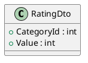

# Probeklausur für POS: Lehrerbewertung

## Umgebung

Im Labor steht Visual Studio 2017 mit der .NET Core Version 2.1.520 zur Verfügung. Die C# Sprachversion
ist 7.3. Daher können keine nullable reference Types oder records verwendet werden. Alle erstellten
C# Projektdateien (csproj) müssen sich daher auf .NET Core 2.1 beziehen:

```xml
  <PropertyGroup>
    <TargetFramework>netcoreapp2.1</TargetFramework>
  </PropertyGroup>
```

## Musterprojekt

In der Datei [Spg_Schoolrating.sln](Spg_Schoolrating.sln) ist
eine Solution auf Basis von .NET Core 2.1 gespeichert, die die grundlegende Aufteilung der Arbeit
schon beinhaltet:

- Projekt Spg_Schoolrating.Application: Domainklassen, Services und Infrastruktur (DbContext)
- Projekt Spg_Schoolrating.Test: Projekt für die xUnit Tests
- Projekt Spg_Schoolrating.Rest: Projekt für die ASP.NET Core 2.1 REST API

## Intro

Vor 1 Jahr sorgte eine App, mit der Lehrer und Schulen bewertet werden konnten, für Aufregung. Nun
soll die App wieder ausgerollt werden und auf Basis von .NET realisiert werden.

Die Grundfeatures bleiben gleich:

- Es können Ratings von 1-5 für Schulen in verschiedenen Kategorien (Sauberkeit, ...) vergeben werden.
- Es können Ratings von 1-5 für Lehrer an den Schulen in verschiedenen Kategorien (Konpetenz, ...) vergeben werden.

Ein Klassendiagramm, welches diese Daten speichern kann, wurde bereits in UML entworfen:

```plantuml
class Address <<embeddable>> {
    + Street : string
    + Zip : string
    + City : string
}
class Name  <<embeddable>> {
    + Title : string
    + Firstname : string
    + Lastname : string
}
class Rating {
    + Value : int
    + RatingDate : DateTime
    + RatingUpdated : DateTime
}
class RatingCategory {
    + Name : string
}
class School {
    + SchoolNumber : int
    + Name : string
    + Address : Address
    + SchoolType : SchoolType
    + PupilsCount : int
}

School --> Address
School --> SchoolType

class SchoolRating {
    + School : School
    + RatingCategory : SchoolRatingCategory
}


Rating <|-- SchoolRating
SchoolRating --> School
SchoolRating --> SchoolRatingCategory

class SchoolRatingCategory {
}
RatingCategory <|-- SchoolRatingCategory
enum SchoolType {
    VS
    AHS
    BHS
    NMS
}
class Teacher {
    + Name : Name
    + Email : string
    + School : School
}

Teacher --> Name
Teacher --> School

class TeacherRating {
    + Teacher : Teacher
    + RatingCategory : TeacherRatingCategory
}
Rating <|-- TeacherRating
TeacherRating --> Teacher
TeacherRating -->  TeacherRatingCategory
class TeacherRatingCategory {
}
RatingCategory <|-- TeacherRatingCategory
```

## Teilthema Domain Model, O/R Mapping und Persistence

### Umsetzen der Datenbank

Setzen Sie das oben abgebildete Klassendiagramm im Projekt *Spg_Schoolrating.Application*
um, sodass mit EF Core eine SQLite Datenbank erzeugt werden kann. Fügen Sie alle Klassen im Ordner
*Domain* ein.

Der DbContext lautet *RatingContext* und ist bereits als Rumpfcode im Ordner *Infrastructure*
vorhanden. Ergänzen Sie hier notwendige Tabellendefinitionen und die entsprechenden Anweisungen in
der Methode *RatingContext.OnModelCreating()*.

Führen Sie nach Abschluss der Arbeiten den Test *DbCreationTest* im Projekt *Spg_Schoolrating.Test*
aus. Er versucht, die Datenbank in zu erstellen und den SQL Dump aus [data.sql](data.sql) zu laden.

> **Hinweis:** Sie können auch beidseitige Navigationen mit einer Liste hinzufügen, damit sich die
> Abfragen einfacher gestalten.

### Abfragen

Implementieren Sie in der Klasse *RatingContext* folgende Methoden. Testen Sie die Methoden mit
jeweils einem Unittest in der Klasse *DbContextTests*. Die korrekten Werte können Sie in DBeaver
ablesen, indem Sie die generierte Datenbank in Ordner
*Spg_Schoolrating.Test/bin/Debug/netcoreapp2.1/Rating.db* öffnen.

#### public School GetSchoolBySchoolNr(int schoolNumber)

Liefert die Schule mit der übergebenen Schulkennzahl (SchoolNumber). Liefert NULL, wenn
keine Schule gefunden wurde.
#### public IQueryable<Teacher> GetTeachersBySchool(int schoolId)

Liefert alle Lehrer einer Schule.

#### public decimal GetAverageTeacherRating(int teacherId, int categoryId)

Liefert die durchschnittliche Bewertung eines Lehres in einer Kategorie.

#### public decimal GetAverageTeacherRating(int teacherId, int categoryId, DateTime ratedFrom)

Liefert die durchschnittliche Bewertung eines Lehres in einer Kategorie. Dabei werden allerdings
nur Ratings berücksichtigt, die nach ratetFrom abgegeben wurden. Ist RatingUpdated gesetzt, ist
dieses Datum für den Vergleich zu verwenden. Ansonsten gilt das Rating Date.

## Teilthema Service Layer / Business Logic

Implementieren Sie die folgenden Methoden und erstellen Sie die erforderlichen DTO Klassen.

#### public SchoolStat GetSchoolStatistics(int schoolId)

Gibt die durchschnittlichen Ratings der übergebenen Schul-ID aus. Sie können die Ausgabe auch
über einen Controller testen: Rufen Sie http://localhost:5000/api/test/SchoolStatistics/1
auf. Es soll folgende Ausgabe erscheinen:

```javascript
{
    "schoolNumber": 726802,
        "categories": [
        {
            "name": "Mensa",
            "avgValue": 2.9
        },
        {
            "name": "Organisation",
            "avgValue": 2.65
        },
        {
            "name": "Sauberkeit",
            "avgValue": 2.85
        },
        {
            "name": "Technische Ausstattung",
            "avgValue": 3.05
        }
    ]
}

```

#### public void InsertSchoolRating(int schoolId, IEnumerable&lt;RatingDto&gt; ratingDtos)

Fügt mehrere Ratings für eine Schule in die Datenbank ein. Die Klasse *RatingDto* besteht aus
2 Properties:



Das *RatingDate* soll auf den Wert aus *DateTime.UtcNow* gesetzt werden. Erstellen Sie einen
Unittest in der Klasse *RatingServiceTests*, die diese Methode überprüft.

#### public void InsertTeacherRating(int teacherId, IEnumerable&lt;RatingDto&gt; ratingDtos)

Fügt mehrere Ratings für einn Lehrer in die Datenbank ein. DIe Klasse *RatingDto* ist wie im
vorigen Beispiel definiert. Auch hier soll der Wert von *RatingDate* auf den Wert aus
*DateTime.UtcNow* gesetzt werden. Erstellen Sie einen
Unittest in der Klasse *RatingServiceTests*, die diese Methode überprüft.

## Teilthema Presentationlayer / REST API

Erstellen Sie einen Controller mit dem Namen *TeacherController* im Projekt *Spg_Schoolrating.Rest*.
Er soll folgende Features abdecken:

#### GET /api/teacher/{schoolnumber}

Liefert alle Lehrer der übergebenen Schulkennzahl (Property *SchoolNumber*) als JSON aus. Die JSON
Daten sollen folgenden Aufbau haben:

```javascript
[
    {
        "Firstname": "string",
        "Lastname": "string",
        "SchoolNumber": number,
        "SchoolName": "string"
    },
    ...
]
```

#### GET /api/teacher/bad?threshold={value}

Liefert alle Lehrer, die ein durchschnittliches Rating kleiner oder gleich dem Wert in Parameter threshold haben.
Das durchschnittliche Rating wird über alle Kategorien hinweg berechnet, d. h. es werden alle
Ratings des Lehrers einfach gemittelt. Die Ausgabe soll so aussehen:

```javascript
[
    {
        "Firstname": "string",
        "Lastname": "string",
        "SchoolNumber": number,
        "SchoolName": "string",
        "AverageRating": number
    },
    ...
]
```

#### POST /api/teacher/{schoolnumber}

Fügt einen Lehrer in die Datenbank ein. Als Schule ist die übergebene Schulkennazhl zu verwenden.
Die Daten des Lehres werden in folgendem Format angegeben:

```javascript
{
  "title": "string",
  "firstname": "string",
  "lastname": "string",
  "email": "string"
}
```

Testen Sie mit Postman, ob die Daten gesendet werden können. Die Route */api/teacher/{schoolnumber}*
muss zur Kontrolle natürlich den eingefügten Lehrer ebenfalls anführen.

