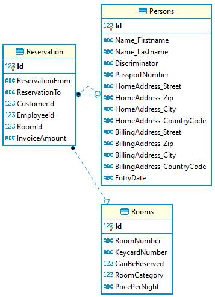

# Probeklausur für POS: Hotelmanager

## Umgebung

Im Labor steht Visual Studio 2017 mit der .NET Core Version 2.1.520 zur Verfügung. Die C# Sprachversion
ist 7.3. Daher können keine nullable reference Types oder records verwendet werden. Alle erstellten
C# Projektdateien (csproj) müssen sich daher auf .NET Core 2.1 beziehen:

```xml
  <PropertyGroup>
    <TargetFramework>netcoreapp2.1</TargetFramework>
  </PropertyGroup>
```

## Musterprojekt

In der Datei [Spg_Hotelmanager.sln](Spg_Hotelmanager.sln) ist
eine Solution auf Basis von .NET Core 2.1 gespeichert, die die grundlegende Aufteilung der Arbeit
schon beinhaltet:

- Projekt Spg_Hotelmanager.Application: Domainklassen, Services und Infrastruktur (DbContext)
- Projekt Spg_Hotelmanager.Test: Projekt für die xUnit Tests
- Projekt Spg_Hotelmanager.Rest: Projekt für die ASP.NET Core 2.1 REST API

## Intro

Ein Hotel beauftragt Sie - falls das Reisen wieder einmal möglich ist - ein System für die Verwaltung
der Reservierungen zu schreiben. Es handelt sich um ein Hotel der gehobenen Kategorie. Das folgende
Klassendiagramm zeigt den Erstentwurf:

```plantuml
enum RoomCategory {
    Basic
    Superior
    Premium
    Suite
}

class Name <<embeddable>> {
    Firstname : String
    Lastname : String
}

class Address <<embeddable>> {
    Street : String
    Zip : String
    City : String
    CountryCode  : String
}

class Person {
    Name : Name
}

class Employee {
    EntryDate : DateTime
}

class Customer {
    PassportNumber : String
    HomeAddress : Address
    BillingAddress : Address
}

class Room {
        RoomNumber : String
        KeycardNumber : String
        CanBeReserved : Boolean
         RoomCategory : RoomCategory
        PricePerNight : Decimal
}
class Reservation    {
    ReservationFrom : DateTime
    ReservationTo: DateTime
    Customer : Customer
    Employee : Employee
    Room : Room
    InvoiceAmount : Decimal
}

Customer --|> Person
Employee --|> Person

Reservation --- Room
Reservation --- Customer
Reservation --- Employee

Person --- Name
Customer --- Address
Customer --- Address

Room --- RoomCategory

```

Im Hotel sind folgende Abläufe abgebildet: Ein Gast fragt um ein Zimmer für einen gewissen
Zeitraum an. Die Reservierung wird eingetragen, hat aber noch kein zugewiesenes Zimmer. Erst
beim Check-in wird das Zimmer zugeteilt. Beim Check-out wird dem Gast die Rechnung zuzüglich
der Konsumation (Minibar, Restaurant, ...) ausgestellt.

Die Prüfung auf Kollisionen geschieht durch den Mitarbeiter an der Rezeption, der einen
grafisch aufbereiteten Belegungsplan vor sich hat.

## Teilthema Domain Model, O/R Mapping und Persistence

Ihre Aufgabe ist es, das entworfene UML Klassendiagramm in C# Klassen umzusetzen. Sie können
dafür einfache POCO Klassen mit offenen set Properties verwenden. Records aus C# 9 oder Klassen
mit Konstruktoren können durch die vorgegebene EF Core 2 bzw. C# 7.3 Umgebung nicht verwendet werden.

Die erstellten Klassen sollen in eine physische SQLite Datenbank persistiert werden. Anforderungen
hinsichtlich der Primärschlüssel (neue Id Felder oder bestehende Felder), der konkreten Datentypen
(nullable, Länge, ...) sind keine vorgeschrieben. Es muss jedoch der in der Datei [data.sql](data.sql)
vorhandene SQL Dump eingespielt werden können.

Dafür wird im Musterprojekt ein Unittest mit dem Namen *DbCreationTest* zur Verfügung gestellt. Er
versucht, die Datenbank auf Basis Ihrer Modelklassen zu erstellen und die Daten zu importieren.

Der SQL Dump geht von folgendem Schema der Datenbank aus, welche aus Ihren Modelklassen heraus
mit *EnsureCreated()* erzeugt werden soll:



Nachdem die Datei [data.sql](data.sql) importiert wurde, implementieren Sie ein *HotelRepository*,
welches folgende Abfragen erlaubt:

- Abfrage *eines Raumes* auf Basis der Keycard Nummer. Rückgabetyp: `Room`
- Abfrage aller Räume einer Kategorie, die buchbar sind (Flag *CanBeReserved*). Rückgabetyp: `IQueryable<Room>`
- Abfrage der Mitarbeiter, die vor einem übergebenen Datum in das Unternehmen eingetreten sind. Rückgabetyp: `IQueryable<Employee>`
- Abfrage der Kunden, die keine Rechnungsadresse eingetragen haben (Die Felder Street, ZIP, City und CountryCode sind NULL). Rückgabetyp: `IQueryable<Customer>`

Sie können die Funktionen auch im DbContext implementieren.

Schreiben Sie Tests in xUnit, welches diese Funktionen aufgrund der Testdaten überprüft. Sie können
die Testdaten mit DBeaver einsehen.

> **Hinweis:** Eine kleine SQL Abfrage in DBeaver liefert am Schnellsten die richtigen Daten.

## Teilthema Service Layer / Business Logic

Schreiben Sie eine Klasse *BookingService*, die zwei für den Businessbetrieb erforderlichen Methoden
beinhaltet:

**int? GetPreferredRoom(int customerId, RoomCategory category)** Gibt das bevorzugte Zimmer (Room-ID)
für eine Reservierung zurück. Die Methode soll so arbeiten:
In der Regel möchte ein Kunde das Zimmer seines letzten Besuches wieder
haben, wenn es in der selben Kategorie ist. Falls die letzte Buchung eine andere Kategorie hat, wird
null geliefert.
Die Methode sucht also heraus, welches Zimmer der Kunde bei seinem letzten Besuch hatte. Natürlich
muss das Zimmer auch buchbar sein. Eine Überprüfung der Zeiträume ist nicht nötig (und auch nicht möglich,
da der Reservierungszeitraum nicht übergeben wird).
Hat ein Kunde noch nie ein Zimmer reserviert, oder ist sein Zimmer nicht buchbar, wird null geliefert.

Als Hilfe für den Test liefert folgendes SQL Statement das zuletzt gebuchte Zimmer des Kunden.

```sql
SELECT r.CustomerId, r.RoomId, r.ReservationFrom AS LastReservationFrom, ro.RoomCategory, ro.CanBeReserved
FROM Reservation r INNER JOIN Rooms ro ON (r.RoomId = ro.Id)
WHERE 
    r.ReservationFrom = (
        SELECT MAX(r2.ReservationFrom) 
        FROM Reservation r2 
        WHERE r2.RoomId IS NOT NULL AND r2.CustomerId = r.CustomerId)
    AND ro.CanBeReserved = 1
ORDER BY r.CustomerId;
```

Es sind Unittests zu erstellen, die die Korrektheit der Methode zeigen.

**List&lt;RevenueCategoryItem&gt; GetCustomerRevenueCategories()** Für Sonderkonditionen, Werbeaussendungen, ... werden Kunden
anhand ihres erbrachten Umsatzes (Summe von *InvoiceAmount*) in Kategorien eingeteilt. Die Kategorie ist
1 für 0 - 9999 €, 2 für 10000 - 19999 €, 3 für 20000 - 29999 €, ... Die Daten sind im nachfolgenden
JSON skizziert. Schreiben Sie eine DTO Klasse *RevenueCategoryItem*, die diese Daten aufnehmen
soll. Die Methode soll `List<RevenueCategoryItem>` zurückgeben.

Zum Testen liefert folgendes SQL Statement diese Aufstellung als flache Tabelle (keine Hierarchie).
Es sind Unittests zu erstellen, die die Korrektheit der Methode zeigen.

```sql
SELECT
    r.CustomerId AS Id, p.Name_Firstname AS Firstname, p.Name_Lastname AS Lastname,
    p.HomeAddress_Street AS Street, p.HomeAddress_Zip || ' ' || p.HomeAddress_City AS City,
    p.HomeAddress_CountryCode AS Country,
    SUM(r.InvoiceAmount) AS Revenue,
    1 + FLOOR(SUM(r.InvoiceAmount)/10000) AS RevenueCategory
FROM Reservation r INNER JOIN Persons p ON (r.CustomerId = p.Id AND p.Discriminator = 'Customer')
GROUP BY r.CustomerId
ORDER BY SUM(r.InvoiceAmount) DESC;
```

```javascript
[
	{
        "RevenueCategory": 3
        "Customers": [
        {
            "Id" : 29,
            "Firstname" : "Mareike",
            "Lastname" : "Bürklein",
            "Street" : "Nobelstr. 06b",
            "City" : "45416 West Sebastian",
            "Country" : "AT",
            "Revenue" : 29146.28,
        },
        {
            "Id" : 16,
            "Firstname" : "Rocco",
            "Lastname" : "Newton",
            "Street" : "Martin-Luther-Str. 91",
            "City" : "01507 Janichland",
            "Country" : "LUX",
            "Revenue" : 27767.75,        
    	}],
    },
	{
        "RevenueCategory": 2
        "Customers": [
        {
            "Id" : 30,
            "Firstname" : "Damian",
            "Lastname" : "Schröder",
            "Street" : "Neustadtstr. 8",
            "City" : "79240 Ludwigscheid",
            "Country" : "HU",
            "Revenue" : 19124.75,
        },
        {
            "Id" : 33,
            "Firstname" : "Enya",
            "Lastname" : "Kock",
            "Street" : "Zur Alten Brauerei 8",
            "City" : "83420 Süd Junaland",
            "Country" : "IT",
            "Revenue" : 17199.34,
            }],
    }
]
```

## Teilthema Presentationlayer / REST API

Konfigurieren Sie zuerst das REST Projekt für den Zugriff auf die Hotel-Datenbank. Dies kann
in der Methode *ConfigureServices()* passieren:

```c#
public void ConfigureServices(IServiceCollection services)
{
    var options = new DbContextOptionsBuilder()
        .UseSqlite("Data Source=Hotel.db")
        .Options;

    using (var db = new HotelContext(options))
    {
        db.Database.EnsureDeleted();
        db.Database.EnsureCreated();
        db.Import("data.sql");
    }

    services.AddDbContext<HotelContext>(opt=>
    {
        opt.UseSqlite("Data Source=Hotel.db");
    });

    // Other Services
}
```

> **Hinweis für das Debugging:** Beim Starten des Servers mit `dotnet watch run` wird die
> Prozess-ID ausgegeben. Nach dieser ID kann in Visual Studio bei *Debug - Attach to Process*
> im Suchfenster gesucht werden.

Implementieren Sie danach einen *ReservationController*, der folgende Methoden unterstützt:

**GET /api/reservation/{Category}**
Liefert ein JSON Dokument mit allen Reservierungen des angegebenen Zimmerkategorie HTTP Status 404,
wenn es nicht gefunden wurde. Die Kategorie wird als Zahlenwert entsprechend dem enum übergeben.

**GET /api/reservation/{Category}?dateFrom={yyyy-mm-dd}**
Liefert ein JSON Dokument mit allen Reservierungen des angegebenen Zimmerkategorie, die ab
dem übergebenen Datum (inklusive) im System eingetragen sind. Liefert HTTP Status 404,
wenn die Kategorie nicht gefunden wurde. Liefert eine leere Liste, wenn keine Reservierungen
ab diesem Datum eingetragen sind.

**POST /api/reservation/**
Trägt eine Reservierungsanfrage ein. Es ist noch kein Raum einzutragen, da dieser dann an
der Rezeption zugeteilt wird. Es wird die Anzahl der Nächte statt dem Enddatum übergeben. Liefert
HTTP 400 (Bad Request), wenn der Kunde bereits in diesem Zeitraum eine aufrechte Reservierung hat.
Sonst wird die erstellte Reservierung zurückgegeben.

*Request Body (*application/json*)*

Diese Daten sind Musterdaten. Die Id Werte müssen nicht der echten Datenbank entsprechen.

```javascript
{
    ReservationFrom: '2021-04-06',
    Nights: 4,
    CustomerId: 10,
    EmployeeId: 1,
}
```

**PUT /api/reservation/setRoom/{reservationId}/{roomId}**

Setzt den Raum der übergebenen Reservierungs-Id. Die Room ID ist die Zimmernummer, nicht der
interne Schlüssel des Zimmers. Liefert HTTP 200 mit der aktualisierten Reservierung oder 404,
wenn keine Reservierung mit der übergebenen Id gefunden wurde. Bestehende Zimmer können
überschrieben werden.

**PUT /api/reservation/invoice/{reservationId}**

Rechnet den Gast ab, indem der Rechnungsbetrag gesetzt wird. Der Rechnungsbetrag besteht aus
*Anzahl der Nächte x Zimmerpreis + zuzügliche Konsumation*. Liefert die aktualisierte Reservierung
oder HTTP 404, wenn die Reservierung nicht gefunden wurde. Liefert HTTP 400, wenn kein Raum
eingetragen ist.

*Request Body (*application/json*)*

Diese Daten sind Musterdaten. Die Id Werte müssen nicht der echten Datenbank entsprechen.

```javascript
{
    Consumption: 245,
}
```

## Abgabe

Falls Punkte in der Aufgabenstellung unvollständig oder fehlerhaft angegeben werden, sind diese
durch eigene Annahmen zu ergänzen und in einer Readme Datei zu dokumentieren.

Verwenden Sie zur Erstellung des Abgabearchives die Datei *backup.cmd*. Sie benötigt das
Programm 7zip im Standardordner (*C:\Program Files\7-Zip\7z.exe*). Das Archiv wird im
Verzeichnis darüber unter dem Namen *Spg_Hotelmanager(timestamp).7z* erstellt. Dies ist dann
in Microsoft Teams abzugeben. Damit die Abgabe berücksichtigt werden kann, muss sie bis spätestens
*Fr, 16.4.2021 23:59* abgegeben werden.

