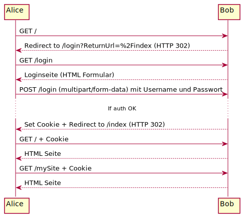
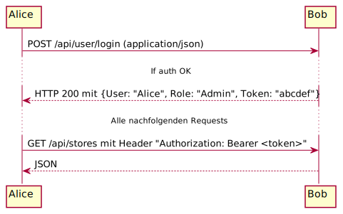

# Authentication und Authorization: Implementierung in der Web Assembly

## Unterschied WebAssembly - "klassisches" Login

In einer klassischen Webapplikation (serverseitig gerendertes HTML) werden Cookies
verwendet, um den Authentifizierungsstatus am Client zu speichern. Dieses Cookie
wird bei jedem Request vom Browser automatisch im Header übertragen.

Auch die fetch API in Javascript überträgt das Cookie, deswegen gilt diese
Grafik auch für AJAX Requests.


<sup>
https://www.plantuml.com/plantuml/uml/ZO_BJiCm44Nt-OgxGMg5dA2ogtWK40L4KQCc_G1JJy723sIF1VmzJWgBHbrqPy-TSpLd5ba6JjOKDqPl2E8Aj_vrYeVx5bMHdn1vr6TJh4ZfG1i6UrJ6lsbtlI9EmQs3kJoPpBLJz8tHOzlME3-RZ0zrzjXVS274BbbqmqYQgQDV5fZxO9EHOLXHBvl_3epo1kjF6RZQvdMX9Cinh6Qi8mKdBI4vXLh6-EK35sLPucaBcVWTosVax_2CXXXttdzemkc-x35ccTd1mzhUgEdi3c7sfyd9CV2Cd4hM_080
</sup>

Unsere Webassembly App ist jedoch eine Client/Server Applikation. Sie kann zwar
über den *HttpClient* auch Cookies speichern, das Verfahren mit einem JWT ist jedoch
einfacher zu implementieren.


<sup>
https://www.plantuml.com/plantuml/uml/NO-zJiCm54RtFCMdJ22Hf6ACgggjX2WWaQeD3-0cDwt1yGt-MK2yEpUc4-EnhNC-htrGBiJHP1kZEqAnmfPFDVRDiKMb9br5JwuoVDOMDsgQv9KAcctrxjdU8YlB4ay3L0mND2yGp4I0GaJ9M6FNjdlSBnOOTS3tc-XgvEaklyE13StOZzeAjln1LbYTkfw6_2VfDyOGhEek0vipsPui3lGPoGUVUl-cFpvSb_l0ZdpAxaZrvAGZCzdfh_aBqjcISdAy37DsbLz5owBuCpqVczTiBSKucby0
</sup>

Der Client (die Webassembly) muss also bei jedem Request einen Header mit dem
Wert *Authorization: Bearer <token>* mitschicken. Zum Glück kann der HTTP
Client diesen Header automatisch generieren, wenn nach erfolgreichem Login das
Property *HttpClient.DefaultRequestHeaders.Authorization* gesetzt wurde.

Genau das passiert in der Methode *TryLogin* im *RestService*:

```c#
public async Task<(bool success, string? message)> TryLoginAsync(LoginDto login)
{
    string jsonContent = JsonSerializer.Serialize(login);
    StringContent request = new StringContent(
        jsonContent, System.Text.Encoding.UTF8, "application/json"
    );
    var response = await _client.PostAsync("user/login", request);
    if (response.StatusCode == System.Net.HttpStatusCode.Unauthorized)
    {
        return (false, "Benutzername oder Passwort falsch.");
    }
    if (!response.IsSuccessStatusCode)
    {
        return (false, "Fehler beim Senden der Logindaten.");
    }
    string result = await response.Content.ReadAsStringAsync();
    var user = JsonSerializer.Deserialize<UserDto>(result, _jsonOptions);
    if (user is null)
    {
        return (false, "Der Server sendete keine gültigen Authentifizierungsdaten.");
    }
    _client.DefaultRequestHeaders.Authorization =
        new System.Net.Http.Headers.AuthenticationHeaderValue("Bearer", user.Token);
    _currentUser = user;
    return (true, null);
}
```

## Die Login Component

Die Login Component [Login.razor](ScsOnlineShop/ScsOnlineShop.Wasm/Pages/Login.razor)
verwendet die Klasse *LoginDto* aus dem *Shared* Projekt. Die Formulardaten werden
über RestService.TryLoginAsync() an die API geschickt:

```c#
private async Task HandleValidSubmit()
{
    Message = null;
    var (success, message) = await RestService.TryLoginAsync(LoginDto);
    if (!success)
    {
        Message = message;
        return;
    }
}
```

Da *TryLoginAsync()* jetzt den Header im HTTP Client gesetzt hat, muss das restliche
Programm nicht mehr geändert werden. Deswegen ist das RestService auch ein Singleton
Service.

## Absichern der Applikation

Die Applikation ist damit auch schon abgesichert. Allerdings würde vor dem Login
jeder Request zu einem geschützten Controller mit einer Exception enden. Der benutzer
müsste händisch auf die Login Seite gehen. Das wollen wir natürlich verbessern.

Um die ganze Applikation hinter einem Login zu verbergen, schreiben wir einfach
die Layoutomponente
[MainLayout.razor](ScsOnlineShop/ScsOnlineShop.Wasm/Shared/MainLayout.razor)
im Ordner *Shared* um:

```html
@inject RestService RestService
@inherits LayoutComponentBase

<div class="page">
    @if (RestService.IsAuthenticated)
    {
        <div class="sidebar">
            <NavMenu />
        </div>

        <div class="main">
            <div class="top-row px-4">
                Angemeldet als Benutzer @RestService.CurrentUser?.Username
                <a href="http://blazor.net" target="_blank" class="ml-md-auto">About</a>
            </div>

            <div class="content px-4">
                @Body
            </div>
        </div>
    }
    else
    {
        <div class="main">
            <ScsOnlineShop.Wasm.Pages.Login />
        </div>
    }
</div>
```

## Token und Local Storage

Wenn die Applikation neu geöffnet (oder das RestService aus anderen Gründen neu
instanziert wird), so muss sich der Benutzer neu anmelden. Der Token kann jedoch
im Local Storage gespeichert werden (über JS Interop).

## Logout

Das Logout kann so implementiert werden, dass der Authentication Header 
(*DefaultRequestHeaders.Authorization*) auf null gesetzt wird. Dadurch wird kein
Token mehr übertragen und die API würde 401 liefern. Natürlich sollte dann am Client
auf die Login Seite umgeleitet werden.
