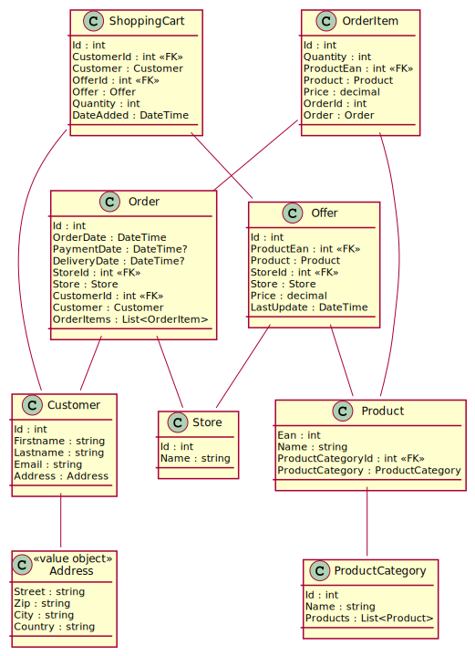

# Blazor Webassemblies

## Inhalt

- [Start](01Start.md)
- [DTO Klassen](02Dtos.md)
- [Controller anlegen](03Controller.md)
- [Erste Komponenten](04Components.md)
- [Komponenten kommunizieren miteinander: Parameter](05Paramters.md)
- [Ein RestService für die Webassembly](06RestService.md)
- [Authentication: API absichern](07AuthenticationApi.md)
- [Authentication: WASM Implementierung](08AuthenticationWasm.md)

Im Ordner *ScsOnlineShop* befindet sich eine vollständige Implementierung einer WASM Applikation.
Die Themenstellung wurde aus einem Maturabeispiel entnommen. Das Klassenmodell ist im *Application*
Projekt als EF Core Model umgesetzt:

## Webassemblies

Quelle: https://www.heise.de/ratgeber/Webprogrammierung-mit-Blazor-WebAssembly-Teil-1-Web-API-Aufrufe-und-Rendering-4932237.html

