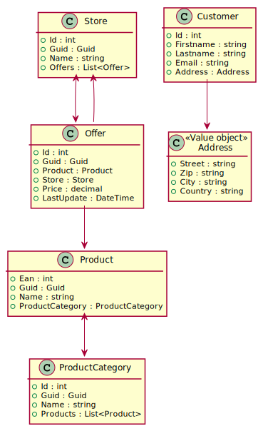
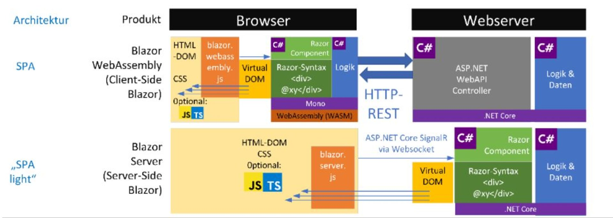

# Blazor Webassemblies

## Inhalt

- [Start](01Start.md)
- [DTO Klassen](02Dtos.md)
- [Controller anlegen](03Controller.md)
- [Erste Komponenten](04Components.md)
- [Komponenten kommunizieren miteinander: Parameter](05Paramters.md)
- [Ein RestService für die Webassembly](06RestService.md)
- [Authentication: API absichern](07AuthenticationApi.md)
- [Authentication: WASM Implementierung](08AuthenticationWasm.md)
- [Verwenden von AutoMapper](09AutoMapper.md)

Im Ordner *ScsOnlineShop* befindet sich eine vollständige Implementierung einer WASM Applikation. Die Demo simuliert ein Shopping Center, in dem mehrere Stores Produkte
anbieten können. Kunden können dann nach Produkten suchen und im jeweiligen Store
die Ware kaufen.

Das Klassenmodell ist im *Application* Projekt als EF Core Model umgesetzt:

https://www.plantuml.com/plantuml/uml/dP71IWCn48RlUOhSfIzGbbAfLOIYGjM3jxYPjYERf6GcXo9zTsURf4XKaEQI_D-4-NzcviGcSdA3sg453MxF1-s0Ty6IKlrWYFIQGmJzgRISgtkhfnezPtMNSDJZbS63SI20EABVPlIusK0aWIiaxavgfeugT-qcava-iUAMnJ_TdcAmgMTXvPLnRZtDmUjFx4TaeKTdXWnNXlXbRmsFbHkvdj61H5CvWqGhBSww-jImHIuCmpR4m-L3AetEOofQ1jLOLOkbyHTwrB1IROYO5PBtqfHhaaKY3kwl9TrY9FO_tLVcLxnq1eU6NLiRWKXeUKcmiwa4gxW6gl-xxjKC2NHu_m2PtQm6N7C4uCRa3VSDMI0VMXIIv_YD7jKSl4rk-080

## Webassemblies

Quelle: https://www.heise.de/ratgeber/Webprogrammierung-mit-Blazor-WebAssembly-Teil-1-Web-API-Aufrufe-und-Rendering-4932237.html

